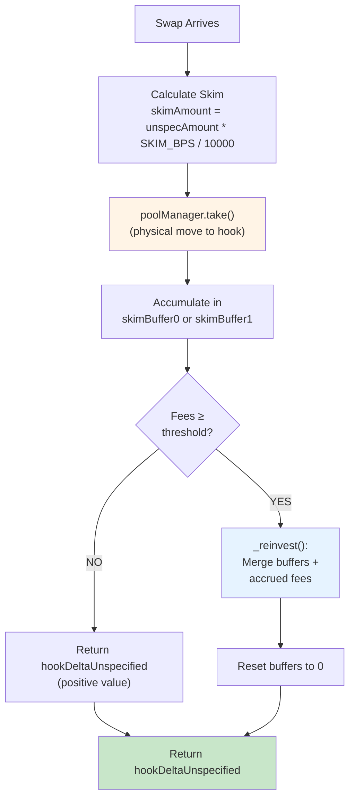

# SelfLPAfterDelta: Auto-Compounding Hook with Return Delta Skimming

**afterSwapReturnDelta implementation** — baseline SelfLPDirect + a skim buffer that collects a fixed basis-point fee on every swap.

## Overview

Extends SelfLPDirect with one new technique: **`afterSwapReturnDelta`**. On every swap, the hook:
1. Skims a fixed percentage (BPS) from the **unspecified side** (output for exactIn, input for exactOut)
2. Physically takes those tokens via `poolManager.take()`
3. Returns a positive `hookDeltaUnspecified` so PoolManager nets the debt against the swapper
4. Accumulates skim in buffers; on reinvest, merges them into the new position

This demonstrates the **return delta** hook pattern and shows how to correctly use flash accounting to take fees.

---

## Skim Flow Diagram



---

## Delta Sign Convention

### `hookDeltaUnspecified` for Skim

- **Value returned:** `int128(skimAmount)` — **positive**
- **Meaning:** Hook took `skimAmount` tokens from the swapper's unspecified-side output
- **Effect:** PoolManager subtracts `skimAmount` from swapper's output, reducing what they receive
- **Flash accounting:** `poolManager.take()` creates a debit on hook; return value shifts that debit to swapper

### Example: exactIn, zeroForOne (ETH → token1)

```
Swap:        0.01 ETH → X token1 (unspecified)
Pool output: X token1 (without hook)

Hook action:
  1. Calculate skim: Y = X * SKIM_BPS / 10000
  2. poolManager.take(token1, hook, Y)      ← hook gets Y
  3. return int128(Y)  ← positive hookDeltaUnspecified

Result:
  Swapper gets: (X - Y) token1  ← reduced by skim
  Hook has:     +Y token1        ← skimmed tokens
  PoolManager:  balanced         ← take() debt offset by return value
```

---

## Implementation Differences from SelfLPDirect

| Aspect | SelfLPDirect | SelfLPAfterDelta |
|--------|-------------|------------------|
| `SKIM_BPS` immutable | ❌ | ✅ (fixed at constructor) |
| `skimBuffer0`, `skimBuffer1` | ❌ | ✅ (observational, for tracking) |
| `getHookPermissions` | `afterSwapReturnDelta: false` | ✅ `afterSwapReturnDelta: true` |
| `_afterSwap` return | `int128(0)` | `int128(skimAmount)` |
| Skim collection | ❌ | ✅ via `poolManager.take()` |
| Buffer merge at reinvest | N/A | ✅ via `balanceOfSelf()` |

---

## Code Walkthrough: `_afterSwap`

```solidity
function _afterSwap(
    address, PoolKey calldata key, SwapParams calldata params,
    BalanceDelta delta, bytes calldata
) internal override returns (bytes4, int128) {
    if (!seeded) return (this.afterSwap.selector, 0);

    // 1. Determine unspecified currency & amount
    bool unspecIsCurrency1 = (params.amountSpecified < 0) == params.zeroForOne;
    int128 unspecAmount = unspecIsCurrency1 ? delta.amount1() : delta.amount0();
    Currency unspecCurrency = unspecIsCurrency1 ? key.currency1 : key.currency0;

    // 2. Calculate & take skim
    uint128 skimAmount = uint128(unspecAmount < 0 ? -unspecAmount : unspecAmount) 
        * SKIM_BPS / 10_000;
    
    if (skimAmount > 0) {
        // Physical move (flash-accounting debit on hook)
        poolManager.take(unspecCurrency, address(this), skimAmount);
        
        // Track in buffer for observability
        if (unspecIsCurrency1) {
            skimBuffer1 += skimAmount;
        } else {
            skimBuffer0 += skimAmount;
        }
    }

    // 3. Fee preview (same as baseline)
    uint256 feesEth = SelfLPLib.previewFeesETH(...);
    if (feesEth < feeThresholdETH) {
        return (this.afterSwap.selector, int128(skimAmount));
    }

    // 4. Reinvest (same as baseline, but skimmed tokens are in balanceOfSelf)
    _reinvest(key, sqrtPriceX96);
    skimBuffer0 = 0;  // Clear buffers (tokens now in position)
    skimBuffer1 = 0;

    return (this.afterSwap.selector, int128(skimAmount));
}
```

---

## How Skimmed Tokens Are Folded Into Position

**When reinvest happens:**

1. **Burn old position** → `burnDelta` credits (principal + accrued fees)
2. **Calculate available balance**
   ```solidity
   uint256 avail0 = uint256(uint128(burnDelta.amount0())) 
       + key.currency0.balanceOfSelf();  // ← includes skimmed tokens!
   uint256 avail1 = uint256(uint128(burnDelta.amount1())) 
       + key.currency1.balanceOfSelf();
   ```
3. **Mint at new range** using `(avail0, avail1)` → automatically includes skim
4. **Clear buffers** after position is minted (tokens are now locked in LP)

**Key insight:** `balanceOfSelf()` captures all tokens, including those from `take()` above. The `skimBuffer` storage is purely observational — it tracks how much was skimmed, but correctness doesn't depend on it.

---

## Configuration

```solidity
uint16 public immutable SKIM_BPS;  // e.g., 100 = 1% of unspecified side
```

Set once at construction. Common values:
- `100` = 1% (aggressive)
- `50` = 0.5% (moderate)
- `10` = 0.1% (light)

---

## Test Coverage

### Standard Tests (Baseline)
- ✅ `test_seedPosition_initialState` — Position initializes correctly
- ✅ `test_seedPosition_idempotent` — Can't seed twice
- ✅ `test_swap_belowThreshold_noReinvest` — Small swaps don't trigger reinvest
- ✅ `test_swap_aboveThreshold_reinvests` — Large swaps trigger reinvest
- ✅ `test_followsPrice` — Range follows market tick
- ✅ `test_native_dustHandling` — Accounting is sound

### Variant-Specific Tests
- ✅ **`test_skim_accumulates`** — Multiple small swaps accumulate skim in buffers
- ✅ **`test_skim_consumedAtReinvest`** — Reinvest clears buffers (tokens folded into position)
- ✅ **`test_returnDelta_sign`** — Return value is positive, correctly signals skim to PoolManager

---

## Key Differences from Plan

The plan mentions optional `skimBuffer` storage "for observability". We **do** keep `skimBuffer0` and `skimBuffer1` because:
1. Tests inspect them to verify skim behavior
2. Future monitoring/analytics can track skims without internal accounting
3. Correctness doesn't depend on them — `balanceOfSelf()` is authoritative

---

## Edge Cases

### 1. Skim When Below Threshold
If skim fires but fees don't cross the reinvest threshold:
- Skim is **physically taken** via `take()`
- Return **positive `hookDeltaUnspecified`** (PoolManager nets against swapper)
- **Don't reinvest** — just accumulate in buffer
- Buffer stays in `address(hook)` as idle inventory until reinvest fires

### 2. Both Exactness Modes
The formula `(params.amountSpecified < 0) == params.zeroForOne` correctly identifies unspecified side in all four combinations:

| `amountSpecified` | `zeroForOne` | Result | Unspecified |
|---|---|---|---|
| < 0 | true | true | currency1 |
| < 0 | false | false | currency0 |
| > 0 | true | false | currency0 |
| > 0 | false | true | currency1 |

### 3. Zero Skim Amount
If `skimAmount == 0` (e.g., very small swap):
- `take()` is **not called**
- Return `int128(0)`
- No buffer accumulation

---

## References

- **SelfLPDirect:** `/home/devops/codex-work/uhi9-return-delta-hook/src/SelfLPDirect.sol`
- **SelfLPLib:** `/home/devops/codex-work/uhi9-return-delta-hook/src/lib/SelfLPLib.sol`
- **Tests:** `/home/devops/codex-work/uhi9-return-delta-hook/test/SelfLPAfterDelta.t.sol`
- **Hooks.sol:** Flag definitions in v4-core
- **InternalSwapPool.sol:** Original example of `afterSwapReturnDelta` usage (lines 258–298)
