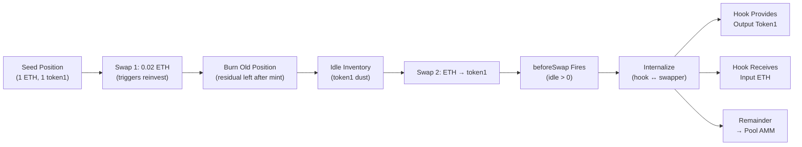
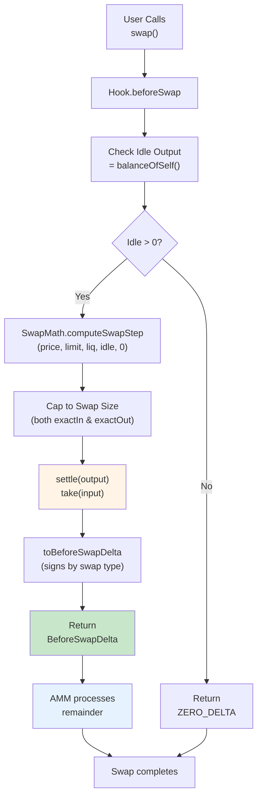

# SelfLPBeforeInternalize: Auto-Compounding Hook with Idle Inventory Internalization

**beforeSwapReturnDelta implementation** — baseline SelfLPDirect + idle inventory puts residual tokens back to work on every swap, improving capital efficiency.

## Overview

Extends SelfLPDirect with one new technique: **`beforeSwapReturnDelta`**. On every swap, the hook:
1. Checks if it has idle inventory of the **output currency** (what the swapper will receive)
2. Uses `SwapMath.computeSwapStep` to compute how much input is needed to provide that output at current price
3. Caps the internalized amount to the actual swap size
4. Physically settles tokens: pays output via `settle()`, receives input via `poolManager.take()`
5. Returns a `BeforeSwapDelta` that reduces the AMM's workload, improving slippage for the swapper
6. The AMM processes only the remainder (if any)

This demonstrates the **return delta** hook pattern and shows how to put idle capital to work without reinvesting.

---

## Idle Inventory Lifecycle



Key insight: Every position rebalance leaves a small residual of one or both currencies. Without internalization, this sits idle. With `beforeSwapReturnDelta`, it's put to work on the very next swap, improving capital efficiency.

---

## BeforeSwapDelta Sign Convention

### Sign Rules

- **Positive value:** Hook took (is owed) currency
- **Negative value:** Hook gave (owes) currency

### All Four Combinations

| `amountSpecified` | `zeroForOne` | Swap Type | Specified | Unspecified | Delta Return |
|---|---|---|---|---|---|
| < 0 | true | exactIn (0→1) | ETH | token1 | `(+in, -out)` |
| < 0 | false | exactIn (1→0) | token1 | ETH | `(+in, -out)` |
| > 0 | true | exactOut (1→0) | token1 | ETH | `(-out, +in)` |
| > 0 | false | exactOut (0→1) | ETH | token1 | `(-out, +in)` |

### Meaning

For **exactIn** (amountSpecified < 0):
- `deltaSpecified` = amount of input hook received (positive)
- `deltaUnspecified` = amount of output hook provided (negative, as a debt)

For **exactOut** (amountSpecified > 0):
- `deltaSpecified` = amount of output hook provided (negative, as a debt)
- `deltaUnspecified` = amount of input hook received (positive)

### Example: Internalize zeroForOne exactIn

```
User swap: -0.001 ETH exactIn → token1 (unspecified)
Idle inventory: 0.5 token1 in hook

beforeSwap logic:
  1. outputIsCurrency1 = true (zeroForOne)
  2. idleOutput = 0.5 token1
  3. computeSwapStep(sqrtPrice, limit, liq, int256(0.5 token1), 0)
     → Returns amountIn = 0.0006 ETH, amountOut = 0.5 token1
  4. Cap to actual swap: amountSpecified = 0.001 ETH
     → amountIn > 0.001 ETH, so cap: amountOut = 0.5 * 0.001 / 0.0006
     → amountOut = 0.833... token1 (capped by idle inventory)
     → amountIn = 0.001 ETH (exactly the swap amount)
  5. Hook settles: pays 0.833 token1, receives 0.001 ETH
  6. Returns BeforeSwapDelta(+0.001, -0.833)

PoolManager sees:
  - Hook owes: 0.001 ETH (positive delta₀)
  - Swapper owes: 0.833 token1 (reduced by internalization)
  - Remainder to AMM: ~0.0002 ETH → token1
```

---

## Implementation: `_beforeSwap`

```solidity
function _beforeSwap(address, PoolKey calldata key, SwapParams calldata params, bytes calldata)
    internal override returns (bytes4, BeforeSwapDelta, uint24)
{
    if (!seeded) return (this.beforeSwap.selector, BeforeSwapDeltaLibrary.ZERO_DELTA, 0);

    // 1. Determine which currency the hook can provide (the output).
    bool outputIsCurrency1 = params.zeroForOne;
    Currency outputCurrency = outputIsCurrency1 ? key.currency1 : key.currency0;
    Currency inputCurrency  = outputIsCurrency1 ? key.currency0 : key.currency1;

    // 2. Check idle inventory of output currency.
    uint256 idleOutput = outputCurrency.balanceOfSelf();
    if (idleOutput == 0) return (this.beforeSwap.selector, BeforeSwapDeltaLibrary.ZERO_DELTA, 0);

    // 3. Compute internalization at current price, up to idle amount.
    (uint160 sqrtPriceX96,,,) = poolManager.getSlot0(_poolId);
    (, uint256 amountIn, uint256 amountOut,) = SwapMath.computeSwapStep(
        sqrtPriceX96,
        params.sqrtPriceLimitX96,
        poolManager.getLiquidity(_poolId),
        int256(idleOutput),   // positive = exactOut: provide up to this much
        0                     // no fee on internalized portion
    );

    // 4. Cap to the actual swap size.
    if (params.amountSpecified < 0) {
        // exactIn: cap amountIn to |amountSpecified|.
        uint256 swapInput = uint256(-params.amountSpecified);
        if (amountIn > swapInput) {
            amountOut = amountOut * swapInput / amountIn;
            amountIn  = swapInput;
        }
    } else {
        // exactOut: cap amountOut to amountSpecified.
        uint256 swapOutput = uint256(params.amountSpecified);
        if (amountOut > swapOutput) {
            amountIn  = amountIn * swapOutput / amountOut;
            amountOut = swapOutput;
        }
    }

    if (amountOut == 0) return (this.beforeSwap.selector, BeforeSwapDeltaLibrary.ZERO_DELTA, 0);

    // 5. Settle: hook pays output, receives input.
    outputCurrency.settle(poolManager, address(this), amountOut, false);
    poolManager.take(inputCurrency, address(this), amountIn);

    // 6. Return BeforeSwapDelta with correct signs.
    BeforeSwapDelta delta = params.amountSpecified < 0
        ? toBeforeSwapDelta(int128(uint128(amountIn)), -int128(uint128(amountOut)))
        : toBeforeSwapDelta(-int128(uint128(amountOut)), int128(uint128(amountIn)));

    return (this.beforeSwap.selector, delta, 0);
}
```

**`_afterSwap` remains identical to SelfLPDirect** (no changes).

---

## Swap Flow Diagram



---

## Configuration

```solidity
// No new immutable configuration vs baseline
// Internalization is automatic when idle inventory exists
// No fee taken on internalized amounts (cross-subsidized by reinvest fees)
```

---

## Test Coverage

### Standard Tests (Baseline)
- ✅ `test_seedPosition_initialState` — Position initializes correctly
- ✅ `test_seedPosition_idempotent` — Can't seed twice
- ✅ `test_swap_belowThreshold_noReinvest` — Small swaps don't trigger reinvest
- ✅ `test_swap_aboveThreshold_reinvests` — Large swaps trigger reinvest
- ✅ `test_followsPrice` — Range follows market tick
- ✅ `test_native_dustHandling` — Accounting is sound

### Variant-Specific Tests
- ✅ **`test_internalize_partialFill`** — Hook receives input and gives output when internaling
- ✅ **`test_internalize_emptyInventory_fallthrough`** — Returns ZERO_DELTA when no idle inventory
- ✅ **`test_beforeDelta_sign`** — BeforeSwapDelta signs match balance changes

---

## Edge Cases

### 1. No Idle Inventory
If `idleOutput == 0`:
- **Return** `ZERO_DELTA` immediately
- Entire swap routes to AMM
- No settlement or token movement by hook

### 2. Partial Internalization (Idle < Swap Output)
If hook's idle inventory is less than the swap's full output:
- Internalize up to idle amount
- `computeSwapStep` computes required input for that output
- Cap the result to swap size
- Return delta for the internalized portion only
- AMM processes the remainder

### 3. Idle < Required Input for Full Swap
If we have 0.5 token1 idle but user wants 1 token1 via exactOut:
- `computeSwapStep(sqrtPrice, limit, liq, int256(0.5 token1), 0)` → returns amountIn needed
- Cap to swapOutput = 1: if computed amountOut < 1, reduce both proportionally
- Result: hook internalizes up to its idle, AMM gets the rest

### 4. Zero Capped Amount
If capping causes `amountOut == 0` after reduction:
- **Return** `ZERO_DELTA` (entire swap to AMM)
- No settlement (nothing to move)

### 5. Cross-Subsidy for Internalization
Unlike `afterSwapReturnDelta` which collects explicit fees, `beforeSwapReturnDelta` has:
- No explicit fee on internalized amounts
- Hook profits only from reinvest fee accumulation
- Internalization is a **service** to swappers (reduces slippage) that improves hook's capital efficiency

---

## Sequence: Before, During, After

```
Before beforeSwap:
  Hook.balances = {ETH: X, token1: Y}
  Pool.state    = {sqrtPrice, tick, liquidity}
  User.delta    = {ETH: -amountSpecified, token1: 0}

In beforeSwap (zeroForOne, amountSpecified < 0):
  1. computeSwapStep(..., int256(Y), 0) → (amountIn, amountOut)
  2. settle(token1, address(this), amountOut)  → Hook pays amountOut
  3. poolManager.take(ETH, address(this), amountIn) → Hook receives amountIn
  4. return toBeforeSwapDelta(+amountIn, -amountOut)

After beforeSwap (BeforeSwapDelta applied):
  Hook.balances = {ETH: X + amountIn, token1: Y - amountOut}
  User.delta    = {ETH: -amountIn, token1: amountOut - amountOut_full}
  PoolManager.sync(delta) → balances user ↔ pool for remainder

In afterSwap (pool has already settled remainder):
  Accrues fees, checks reinvest threshold, rebalances if needed
  (Same as SelfLPDirect)

After all hooks:
  Complete swap with improved slippage for swapper
  Hook's idle inventory reduced by internalized amount
  Profits from reinvest fees, not from skim
```

---

## References

- **SelfLPDirect:** `/home/devops/codex-work/uhi9-return-delta-hook/src/SelfLPDirect.sol`
- **SelfLPLib:** `/home/devops/codex-work/uhi9-return-delta-hook/src/lib/SelfLPLib.sol`
- **Tests:** `/home/devops/codex-work/uhi9-return-delta-hook/test/SelfLPBeforeInternalize.t.sol`
- **SwapMath.computeSwapStep:** v4-core library for exact in/out calculations
- **BeforeSwapDelta:** v4-core type for representing hook's swap fill
- **InternalSwapPool.sol:** Original example of `beforeSwapReturnDelta` usage

