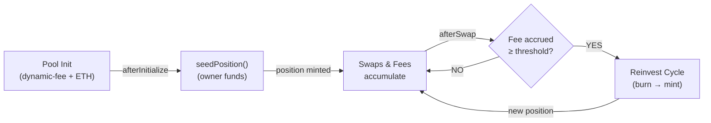
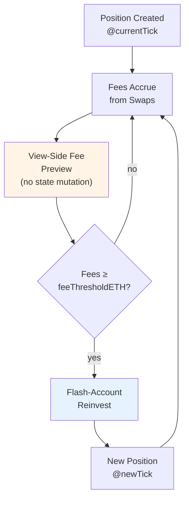
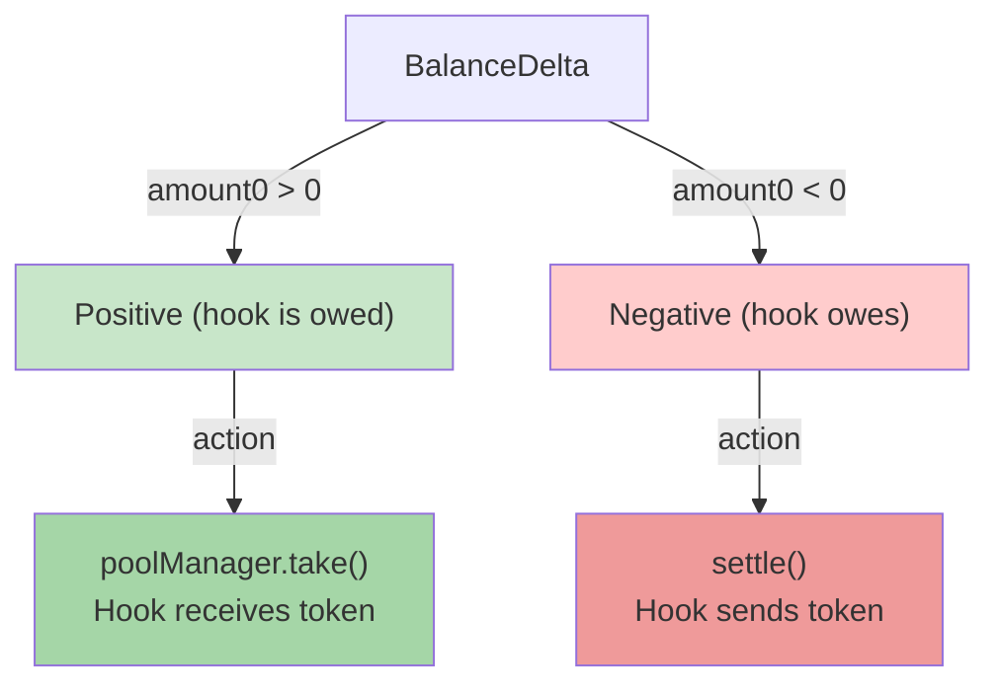
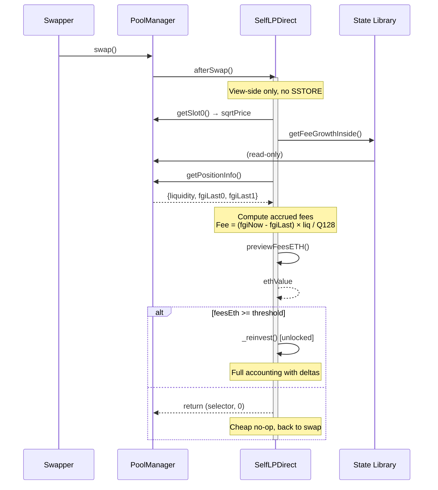

# SelfLPDirect: Auto-Compounding Hook (Baseline Variant)

**Direct custom-accounting implementation** — the most straightforward approach to auto-compounding LP positions in Uniswap V4.

## Overview

- **Position ownership:** Direct via `modifyLiquidity`, no PositionManager or NFT
- **Fee preview:** View-side only (no SSTORE), using StateLibrary
- **Fee claim:** Via `modifyLiquidity` "poke" (liquidityDelta = 0)
- **Token movement:** Flash accounting via delta netting

This is the **baseline of three variants**. See [Variants](#variants) below.

---

## Architecture Overview

### Hook Lifecycle



### Position State Machine



---

## Delta Accounting: The Reinvest Flow

The core innovation is **flash accounting** — netting multiple deltas without physical token movement until final settlement.

### Step-by-Step: Burn → Mint → Settle

```
┌─────────────────────────────────────────────────────────────────┐
│ REINVEST CYCLE (inside swapper's existing unlock)               │
└─────────────────────────────────────────────────────────────────┘

BEFORE:
  Hook's Position: [currency0: 100, currency1: 50] @ [tick 0..100]
  Hook's Idle:     [currency0: 5,   currency1: 3 ]
  Accrued Fees:    [currency0: 2,   currency1: 1 ]  ← in position

STEP 1: BURN Old Position
  ┌──────────────────────────────────────┐
  │ poolManager.modifyLiquidity(          │
  │   liquidityDelta = -oldLiq,           │
  │   salt = POSITION_SALT                │
  │ )                                    │
  └──────────────────────────────────────┘
            ↓
  burnDelta = {
    amount0: +102,  ← principal (100) + fees (2), virtual credit
    amount1: +51    ← principal (50) + fees (1), virtual credit
  }
  
  ⚠️  CRITICAL: No physical token movement here!
      We're in a callback → manager balance still = pre-swap
      Keeping delta virtual avoids OutOfFunds

STEP 2: Compute New Range & Target Liquidity
  ┌──────────────────────────────────────┐
  │ tickAfter = poolManager.getSlot0()   │
  │ (newLower, newUpper) = computeRange()│
  │                                      │
  │ available = burnDelta + idle balance │
  │   avail0 = 102 + 5 = 107             │
  │   avail1 = 51 + 3 = 54               │
  │                                      │
  │ newLiq = getLiquidityForAmounts(     │
  │   available0, available1             │
  │ )                                    │
  └──────────────────────────────────────┘
            ↓
  newLiq = 105  (uses max liquidity from available balances)

STEP 3: MINT New Position
  ┌──────────────────────────────────────┐
  │ poolManager.modifyLiquidity(          │
  │   liquidityDelta = +newLiq,           │
  │   salt = POSITION_SALT                │
  │ )                                    │
  └──────────────────────────────────────┘
            ↓
  mintDelta = {
    amount0: -103,  ← debt to manager (negative = owe)
    amount1: -50
  }
  
  Now hook's virtual account = burnDelta + mintDelta:
    virt_amount0 = 102 - 103 = -1
    virt_amount1 = 51 - 50 = +1

STEP 4: SETTLE Net Delta
  ┌──────────────────────────────────────┐
  │ _settleDelta(burnDelta + mintDelta)   │
  │                                      │
  │ if amount0 < 0: settle (pay) 1 token0│
  │ if amount1 > 0: take (receive) 1 token1│
  │                                      │
  │ (only tiny residue moves physically)  │
  └──────────────────────────────────────┘

AFTER:
  Hook's New Position: [currency0: 103, currency1: 50] @ [tick X..Y]
  Hook's Idle:        [currency0: 0,   currency1: 3 ] (small surplus)
```

---

## Delta Visualization: Sign Conventions



### Example: Burn + Mint Netting

```
burnDelta:
  amount0: +102  (positive → owed to hook)
  amount1: +51   (positive → owed to hook)

mintDelta:
  amount0: -103  (negative → hook owes)
  amount1: -50   (negative → hook owes)

NETTED:
  amount0: 102 - 103 = -1  ← settle: hook sends 1 token0
  amount1: 51 - 50 = +1    ← take: hook receives 1 token1

Physical movement:
  ✓ Send 1 token0 to manager
  ✓ Receive 1 token1 from manager
  ✓ Huge savings vs. moving 102+103=205 token0 and 51+50=101 token1
```

---

## Fee Preview: View-Side Accounting

No state mutation → cheap no-op path.



---

## Configuration

```solidity
address public immutable owner              // Owner funds initial position
int24 public immutable halfWidthTicks       // Range half-width (e.g., 500)
uint256 public immutable feeThresholdETH   // Trigger threshold (e.g., 0.01 ETH)
uint24 public immutable lpFee              // Dynamic fee (e.g., 3000 = 0.30%)
```

## State After Seeding & Running

```solidity
PoolKey _poolKey                   // Pool this hook is attached to
PoolId _poolId                     // Hash of _poolKey
bool ethIsCurrency0               // Which currency is ETH?
int24 currentTickLower            // Active position lower tick
int24 currentTickUpper            // Active position upper tick
uint128 currentLiquidity          // Current position's liquidity amount
bool seeded                       // Position initialized?
```

---

## Core Methods

### `seedPosition(uint256 amount0, uint256 amount1)`

Owner-only. Deposits initial capital, computes range around current tick, mints first position.

**Flow:**
1. Validate owner & single-seed guard
2. Pull currencies (ETH via msg.value, ERC20 via transfer)
3. Compute centered range: `computeRange(tickCurrent, halfWidthTicks, spacing)`
4. Calculate liquidity from amounts
5. **Unlock manager** → `unlockCallback` → `modifyLiquidity(..., liquidityDelta=+newLiq)`
6. Settle delta (if surplus/deficit)
7. Mark `seeded = true`

### `afterSwap(…) → bytes4, int128`

Hooked on every swap. Two paths:

#### Path A: No-Op (common case)
- Check position seeded → return early if not
- **View-side** fee preview (no SSTORE, no unlock re-entry)
- If accrued fees < threshold → return selector + 0

#### Path B: Reinvest (triggered rarely)
- Call `_reinvest(key, sqrtPriceX96)` inside swapper's unlock
- Burn old position → flash-account virtual delta
- Mint new position → netting
- Settle residue via take/settle

### `_reinvest(PoolKey, uint160 sqrtPriceX96)`

1. **Burn old position**
   ```
   burnDelta = modifyLiquidity(..., liquidityDelta=-oldLiq)
   ```
   Result: `+amount0`, `+amount1` (virtual credits, not physical yet)

2. **Compute new range** around post-swap tick

3. **Calculate available liquidity**
   ```
   avail = burnDelta + idle balance
   newLiq = getLiquidityForAmounts(avail0, avail1)
   ```

4. **Mint new position**
   ```
   mintDelta = modifyLiquidity(..., liquidityDelta=+newLiq)
   ```
   Result: `-amount0`, `-amount1` (debts to manager)

5. **Net and settle**
   ```
   netDelta = burnDelta + mintDelta
   _settleDelta(netDelta)  // Physical move for residue only
   ```

6. **Emit event**, update state

---

## Why Flash Accounting?

**The Problem:**
```
Naive approach:
  1. Burn old position → take 102 token0, 51 token1 (physical move)
  2. Mint new position → settle 103 token0, 50 token1 (physical move)
  
  Total: 4 token movements, gas ≈ 4× {take/settle costs}
```

**Flash Accounting:**
```
Smart approach (inside unlock):
  1. Burn → accumulate delta: burnDelta = {+102, +51}
  2. Mint → accumulate delta: mintDelta = {-103, -50}
  3. Net only: {-1, +1} — 2 movements
  
  Total: 2 token movements, gas ≈ 2× savings
```

The key: **we don't physically move anything until we've computed both deltas**, so we can optimize the final settlement.

---

## Edge Cases & Gotchas

### 1. **OutOfFunds Prevention**
After burn inside a swap callback, the manager's physical token balance is still pre-swap (swapper hasn't settled yet). 
- ❌ Calling `take()` with the full burn amount → **reverts**
- ✓ Using flash accounting (keeping delta virtual) → **safe**

### 2. **Tick Snapshot**
Position range is computed from **post-swap tick**, not pre-swap. This ensures the new range adapts to market movement before reinvesting fees.

### 3. **No Rebalance Swap**
The baseline skips optional rebalancing. Surplus on one side becomes idle inventory, folded into the next reinvest. Future variants (`SelfLPAfterDelta`, `SelfLPBeforeInternalize`) may add it.

### 4. **Single Position per Hook**
Each hook instance owns exactly one concentrated position at a time. Salt is fixed at 0.

---

## Variants

This is the **baseline** of three variants exploring custom-accounting styles:

### 1. **SelfLPDirect** (current)
- Direct `modifyLiquidity` calls
- Flash accounting via delta netting
- View-side fee preview

### 2. **SelfLPAfterDelta** (forthcoming)
- Leverage `afterAddLiquidityReturnDelta` / `afterRemoveLiquidityReturnDelta`
- Hook returns custom deltas, PoolManager applies them
- Still own position, but cleaner callback flow

### 3. **SelfLPBeforeInternalize** (forthcoming)
- Pre-compute position adjustments
- Use `beforeSwapReturnDelta` to pre-bake fee reinvestment into the swap itself
- Explores internalizing the entire reinvest into the swap path

All three use the same **SelfLPLib** shared helpers for range snapping, fee preview, and rebalance logic.

---

## References

- **Uniswap V4 Hooks:** https://github.com/uniswap/v4-core
- **BaseHook:** v4-hooks-public/src/base/BaseHook.sol
- **BalanceDelta & Settlement:** @uniswap/v4-core/src/types/BalanceDelta.sol
- **StateLibrary (fee growth):** @uniswap/v4-core/src/libraries/StateLibrary.sol
- **LiquidityAmounts:** @uniswap/v4-core/test/utils/LiquidityAmounts.sol
